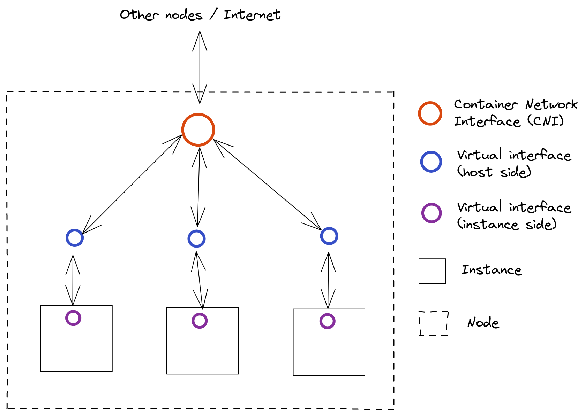

# Network

## How it works

### Introduction

The objective of the network service is to make several instances communicate with each other as if they were all connected to a huge private network, no matter if they are on the same machine or not.

### Suggested approach

To try to solve this problem, the network service is responsible for creating, configuring and deleting virtual network interfaces used to connect instances to each other within a cluster.

When adding a new node to a cluster, a call to the network service must be done to set up a new container network interface (CNI). A CNI links the virtual interfaces associated with the instances running on that node to the rest of the cluster.

A call to the network service must also be made before creating a new instance in order to set up the virtual network interface connecting the instance to a CNI.

After the destruction of an instance, the network service must be called to remove the network interface associated with it and reconfigure the routing tables.



## API

### Messages

```protobuf
// Request structure used to create a new virtual interface
message CreateInterfaceRequest {
    string ip_address = 1;
    repeated int32 ports = 2;
}

// Response structure returned after a new virtual interface has been created
message CreateInterfaceResponse {
    string interface_name = 1;
}

// Request structure used to delete a virtual interface
message DeleteInterfaceRequest {
    string interface_name = 1;
}

// Request structure used to create a new virtual network interface
message CreateContainerNetworkInterfaceRequest {
    string ip_address = 1;
    string sub_network = 2;
}

// Response structure returned after a new network interface has been created
message CreateContainerNetworkInterfaceResponse {
    string interface_name = 1;
}
```

### Services

```protobuf
service Network {
    // Create a new virtual inerface
    rpc CreateInterface(CreateInterfaceRequest) returns (CreateInterfaceResponse) {}
    // Delete a virtual interface
    rpc DeleteInterface(DeleteInterfaceRequest) returns (Empty) {}
    // Create a new virtual network interface
    rpc CreateContainerNetworkInterface(CreateContainerNetworkInterfaceRequest) returns (CreateContainerNetworkInterfaceResponse) {}
}
```